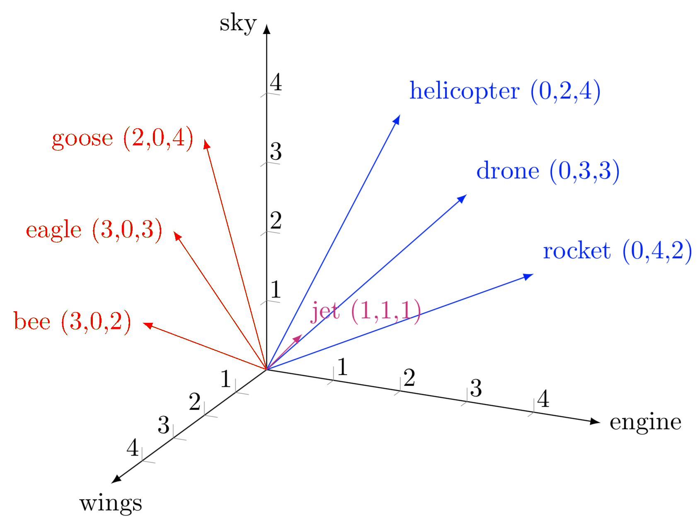

# Embedding models

Encoder models produces embeddings. Embeddings are vectorized representations of the inputs (see the Image). These embeddings can model mathematical relationships between semantic units (e.g., words). This is useful for some use cases, such as measuring the relevance from one word into a certain text, or comparing the similarity between two texts.

**SplitterMR** incorporates these models to automatically compute the chunks from a text based on their semantic similarity between each sentence. So, chunks will be grouped by their contextual similarity, and not for a specified chunk size or other criteria. This splitting method is known as `SemanticSplitter`. 

Next, we present the embedding models available to encode text. Note that that you can always use any model that we define with `BaseEmbedding` to use your own Embedding models.

## Embedders

### BaseEmbedding

::: src.splitter_mr.embedding.base_embedding
    handler: python
    options:
      members_order: source

### OpenAIEmbedding

::: src.splitter_mr.embedding.embeddings.openai_embedding
    handler: python
    options:
      members_order: source

### AzureOpenAIEmbedding

::: src.splitter_mr.embedding.embeddings.azure_openai_embedding
    handler: python
    options:
      members_order: source