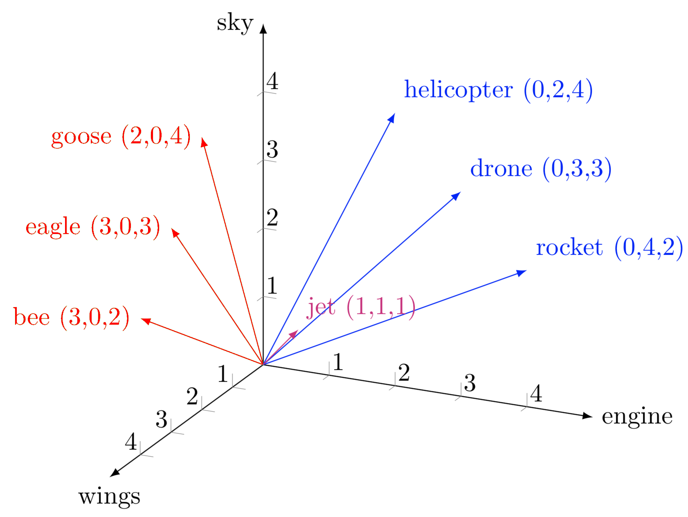

# **Embedding Models**

## Overview

Encoder models are the engines which produce *embeddings*. These embeddings are distributed and vectorized representations of a text. These embeddings allows to capture relationships between semantic units (commonly words, but can be sentences, or even multimodal content such as images).  

These embeddings can be used in a variety of tasks, such as:

- Measuring how relevant a word is within a text.  
- Comparing the similarity between two pieces of text.  
- Power searching, clustering, and recommendation systems building.  



**SplitterMR** takes advantage of these models in [**`SemanticSplitter`**](./splitter.md#semanticsplitter). These representations are used to break text into chunks based on *meaning*, not just size. Sentences with similar context end up together, regardless of length or position.

## Using `embed_text` and `embed_documents`

**`embed_text`** returns one embedding vector (`List[float]`) for a single string. **`embed_documents`** embeds many strings in one call when the backend supports batching (recommended for [`SemanticSplitter`](./splitter.md#semanticsplitter)).

```python
from splitter_mr.embedding import OpenRouterEmbedding

embedder = OpenRouterEmbedding()  # OPENROUTER_API_KEY; optional OPENROUTER_EMBEDDING_MODEL

vector = embedder.embed_text("SplitterMR chunks documents for LLM apps.")
vectors = embedder.embed_documents(["First sentence.", "Second sentence."])
print(len(vector), len(vectors))
```

Token limits are validated on OpenAI-compatible embedders (including OpenRouter) using the same rules as [**OpenAIEmbedding**](#openaiembedding).

## Which embedder should I use?

All embedders inherit from [**BaseEmbedding**](#baseembedding) and expose **`embed_text`** and **`embed_documents`** for generating embeddings. Choose based on your cloud provider, credentials, and compliance needs.

| Model                                             | When to use                                                                 | Requirements                                                                                                        | Features                                                                                                            |
| ------------------------------------------------- | --------------------------------------------------------------------------- | ------------------------------------------------------------------------------------------------------------------- | ------------------------------------------------------------------------------------------------------------------- |
| <span class="table-badge-cell">[**OpenRouterEmbedding**](#openrouterembedding)</span> | **Recommended:** many embedding models via one OpenRouter API key           | `OPENROUTER_API_KEY` (optional: `OPENROUTER_EMBEDDING_MODEL`, defaults to `"openai/text-embedding-3-large"`)          | OpenAI SDK with OpenRouter base URL; any embedding model slug; tiktoken length validation.                            |
| <span class="table-badge-cell">[**OpenAIEmbedding**](#openaiembedding)</span>           | You have an OpenAI API key and want to use OpenAI’s hosted embeddings       | `OPENAI_API_KEY` (optional: `OPENAI_EMBEDDING_MODEL`, defaults to `"text-embedding-3-large"`)                                                                                                    | Production-ready text embeddings; simple setup; broad ecosystem/tooling support.                                    |
| <span class="table-badge-cell">[**AzureOpenAIEmbedding**](#azureopenaiembedding)</span> | Your organization uses Azure OpenAI Services                                | `AZURE_OPENAI_API_KEY`, `AZURE_OPENAI_ENDPOINT`, `AZURE_OPENAI_DEPLOYMENT` (default deployment name: `text-embedding-3-large`)                                          | Enterprise controls, Azure compliance & data residency; integrates with Azure identity.                             |
| <span class="table-badge-cell">[**GeminiEmbedding**](#geminiembedding)</span>           | You want Google’s Gemini text embeddings                                    | `GEMINI_API_KEY` + **Multimodal extra**: `pip install 'splitter-mr[multimodal]'` (optional: `GEMINI_EMBEDDING_MODEL`, defaults to `"gemini-embedding-001"`)                                      | Google Gemini API; modern, high-quality text embeddings.                                                            |
| <span class="table-badge-cell">[**AnthropicEmbeddings**](#anthropicembedding)</span>   | You want embeddings aligned with Anthropic guidance (via Voyage AI)         | `VOYAGE_API_KEY` + **Multimodal extra**: `pip install 'splitter-mr[multimodal]'` (optional: `VOYAGE_MODEL`, defaults to `"voyage-4-large"`)                                      | Voyage AI embeddings (general, code, finance, law, multimodal); supports `input_type` for query/document asymmetry. |
| <span class="table-badge-cell">[**HuggingFaceEmbedding**](#huggingfaceembedding)</span> | Prefer local/open-source models (Sentence-Transformers); offline capability | **Multimodal extra**: `pip install 'splitter-mr[multimodal]'` (default model: `ibm-granite/granite-embedding-english-r2`; optional: `HF_ACCESS_TOKEN`) | No API key; huge model zoo; CPU/GPU/MPS; optional L2 normalization for cosine similarity.                           |
| [**BaseEmbedding**](#baseembedding)               | Abstract base, not used directly                                            | –                                                                                                                   | Implement to plug in a custom or self-hosted embedder.                                                              |

!!! note

    In case that you want to bring your own embedding provider, you can easily implement the class using [**`BaseEmbedding`**](#baseembedding).

## Embedders

### BaseEmbedding

::: src.splitter_mr.embedding.base_embedding
    handler: python
    options:
      members_order: source

### OpenAIEmbedding


::: src.splitter_mr.embedding.embeddings.openai_embedding
    handler: python
    options:
      members_order: source

### AzureOpenAIEmbedding


::: src.splitter_mr.embedding.embeddings.azure_openai_embedding
    handler: python
    options:
      members_order: source

### GeminiEmbedding


::: src.splitter_mr.embedding.embeddings.gemini_embedding
    handler: python
    options:
      members_order: source

### AnthropicEmbedding


::: src.splitter_mr.embedding.embeddings.anthropic_embedding
    handler: python
    options:
      members_order: source

### OpenRouterEmbedding


::: src.splitter_mr.embedding.embeddings.openrouter_embedding
    handler: python
    options:
      members_order: source

### HuggingFaceEmbedding

!!! warning

    Currently, only models compatible with `sentence-transformers` library are available. 


::: src.splitter_mr.embedding.embeddings.huggingface_embedding
    handler: python
    options:
      members_order: source
